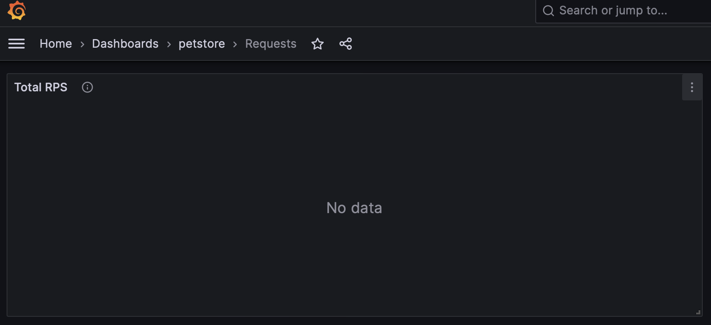
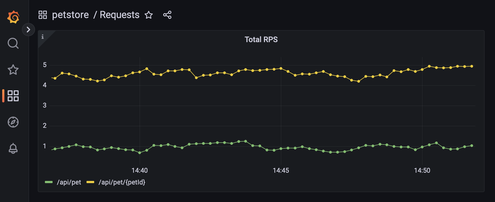

# Tannin Backend Home Assignment

## General Info

You should not encounter any problems in the setup phase. If that happens - please let us know.

In general, please reach out if you have questions or concerns before and during the assignment.

When you're done, you can either:

1. Email your repo.

2. Setup a private GitHub repo and invite @hodbn and @itaischwartz as collaborators.

## Rules

1. The assignment should take up to five hours. Code is never perfect :)

2. Don’t use any more third-party libraries (i.e., your `go.mod` must not change).

3. Don’t complete the implementation of the service’s logic (no need to implement `DELETE`, etc).

4. The code you add should be production-grade, it’s your judgment what that means.

## Objective

This is an existing pet store service based on the [pet store API](https://github.com/swagger-api/swagger-petstore) with a simple monitoring stack of [Prometheus](https://prometheus.io/) and [Grafana](https://grafana.com/).

Add a requests-per-second metric to the server, partitioned by the route (bonus: also partition by [HTTP method](https://developer.mozilla.org/en-US/docs/Web/HTTP/Methods)).

Note: Your code can assume the usage of the [gorilla/mux](https://github.com/gorilla/mux) framework.

## Setup

```console
foo@bar:~$ docker compose up --build
...
foo@bar:~$ # docker compose down -v
...
```

The services will be available on:

- petstore: http://localhost:9900/api

- prometheus: http://localhost:9901/

- grafana: http://localhost:9902/

Additionally, this setup will run a traffic generator against petstore with:

- pet creations: ~1 rps

- pet retrievals: ~5 rps

You can see the predefined dashboard on [grafana](http://localhost:9902/d/Cq0N8Y54k/requests) (default creds are `admin:admin`). Before you complete the assignment it'll look like this:


After you're done, it should look like this:


## Standalone

You can build the service binary and run it with

```bash
foo@bar:~$ make run
CGO_ENABLED=0 go build -v -o server cmd/app/main.go
./server
INFO[0000] Starting HTTP server
```

The server will serve the service on http://localhost:8080/api.

## Tests

We've implemented some tests for you. You can run them with:

```bash
foo@bar:~$ make test
go test -race ./... -coverpkg=./... -coverprofile=cover.txt
?       github.com/tanninio/home-assignment/internal/app        [no test files]
?       github.com/tanninio/home-assignment/internal/common     [no test files]
ok      github.com/tanninio/home-assignment/cmd/app     1.635s  coverage: 64.0% of statements in ./...
ok      github.com/tanninio/home-assignment/internal/adapters   1.972s  coverage: 44.8% of statements in ./...
ok      github.com/tanninio/home-assignment/internal/ports/http 2.255s  coverage: 3.9% of statements in ./...
```
